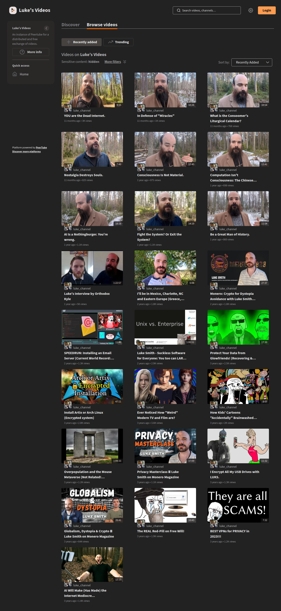

# Visited: https://videos.lukesmith.xyz
**Time:** Tue May  5 21:36:25 UTC 2026

## Screenshot

## Raw HTML
[page.html](./page.html)

## Downloaded Media (2 files)
## Downloaded Media Files

## Other Links
- [/client/en-US/](/client/en-US/)
- [/manifest.webmanifest?2bcc9bc5a4d383acaeb83eb6eab34913f7bef72b](/manifest.webmanifest?2bcc9bc5a4d383acaeb83eb6eab34913f7bef72b)
- [chunk-5SMSNSGT.js](chunk-5SMSNSGT.js)
- [chunk-ENPU72VT.js](chunk-ENPU72VT.js)
- [chunk-HYNN4P6V.js](chunk-HYNN4P6V.js)
- [chunk-KQLVTJ3T.js](chunk-KQLVTJ3T.js)
- [chunk-L2F5KPFC.js](chunk-L2F5KPFC.js)
- [chunk-LSEE2QAG.js](chunk-LSEE2QAG.js)
- [chunk-NHR6KTSM.js](chunk-NHR6KTSM.js)
- [chunk-NJBP3FOQ.js](chunk-NJBP3FOQ.js)
- [chunk-SEURN4CU.js](chunk-SEURN4CU.js)
- [chunk-V7IRVSTI.js](chunk-V7IRVSTI.js)
- [https://docs.joinpeertube.org/use/third-party-application](https://docs.joinpeertube.org/use/third-party-application)
- [https://framagit.org/framasoft/peertube/PeerTube](https://framagit.org/framasoft/peertube/PeerTube)
- [https://github.com/Chocobozzz/PeerTube](https://github.com/Chocobozzz/PeerTube)
- [https://github.com/Chocobozzz/PeerTube/issues/new](https://github.com/Chocobozzz/PeerTube/issues/new)
- [https://videos.lukesmith.xyz](https://videos.lukesmith.xyz)
- [https://videos.lukesmith.xyz/feeds/videos.xml](https://videos.lukesmith.xyz/feeds/videos.xml)
- [https://www.mozilla.org](https://www.mozilla.org)
- [main-DZHYHU4C.js](main-DZHYHU4C.js)
- [polyfills-NWR3SJ4K.js](polyfills-NWR3SJ4K.js)
- [styles-NI64L63M.css](styles-NI64L63M.css)

## Stats
- Links: 24
- Media: 2
